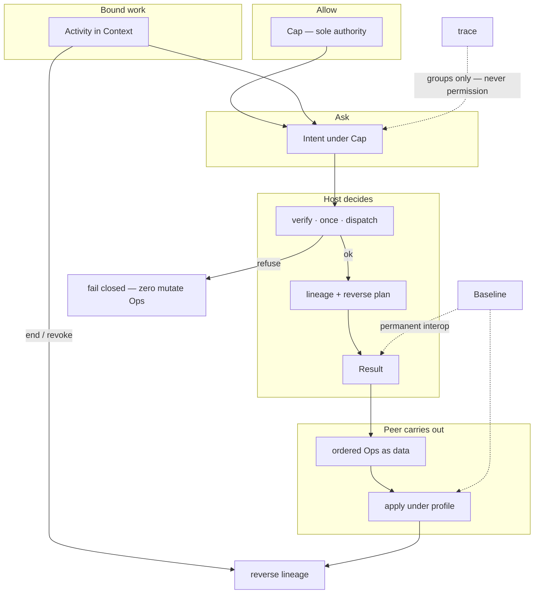

# Mental model

Read [docs/README.md](README.md) first if you are new.

Law lives in [`CORE/`](../CORE/). This page is the one-screen model.

---

## Core thesis

**CEK exists to make shared-world change Cap-only, Ops-only, and honestly reversible — so “who authorized this write, and how is it undone?” stays answerable.**

It is frozen **law and vocabulary**, not a package. Kernels that claim alignment implement this law in [cek-runtime](https://github.com/bitplorer/cek-runtime), [cek-python](https://github.com/bitplorer/cek-python), and domain packs such as [cek-hw](https://github.com/bitplorer/cek-hw).

Official name: **CEK** (Cap-Effect Meta-Language). **Ops** is the carry-out list. Ops is not the language name.

---

## One picture



Source: [`diagrams/00-mental-model.mmd`](../diagrams/00-mental-model.mmd).

If diagrams are stripped:

```text
mint Cap → submit Intent → Host verify
        → Result{Ops} → Peer apply
        → Activity bounds work → lineage records causes
        → end/revoke → reverse (or mark non-reversible)
        → trace only groups steps → Baseline always still works
```

---

## Axioms

Constitutional set: [`CORE/03-axioms.md`](../CORE/03-axioms.md). Features do not relax them without charter amendment.

Reader-facing compression (each line is absolute):

| # | Law | Statement |
|---|-----|-----------|
| 1 | **Cap-only truth** | The only proof of authority is a verified Cap. (A1) |
| 2 | **Ops-only effects** | The only side-effects at the kernel boundary are explicit ordered Ops. (A2) |
| 3 | **Host decides, Peer applies** | Exactly two L1 kernels. Peer does not mint root Caps or invent truth. (A7, CORE/06) |
| 4 | **Lineage then reverse** | Revocable Cap or endable Activity records cause and reverses — or marks non-reversible. (A3) |
| 5 | **Fail closed** | Bad Cap, missing required once-store, or required lineage write failure refuses. Zero mutate Ops. (A5) |
| 6 | **trace is not permission** | A trace groups Intents. It never grants, executes, or undoes. (A6) |
| 7 | **Baseline never silent-breaks** | New power is additive or versioned. (A4) |

Remaining constitutional axioms, still in force:

- **A8** — `limit` / `isolate` only narrow. They never widen.
- **A9** — Activity open / part load is Cap-gated (or explicit Host-only bootstrap).
- **A10** — One concept, one name.

---

## Closed intention set

Every kernel noun maps to exactly one row. Trace is orthogonal: it does not ask, allow, carry out, bound, or undo.

| Intention | Concepts |
|-----------|----------|
| Ask | Intent, submit |
| Allow | Cap, mint |
| Carry out | Ops, apply, Result |
| Bound | Activity, Context, inject, limit, isolate, part |
| Remember / undo | lineage, reverse |
| Correlate only | trace |

Source: [`CORE/02-intentions.md`](../CORE/02-intentions.md).

---

## Kernel nouns (one line each)

| Noun | Job |
|------|-----|
| **Cap** | Permission ticket to submit a class of Intent |
| **Intent** | The ask under a Cap |
| **Host** | Verifies Cap, records lineage, returns `Result{Ops}` |
| **Peer** | Applies Ops only |
| **Ops** | Ordered effects as data |
| **Result** | Host answer: ok / authority_refusal / dispatch_error |
| **Activity** | Bounded work with a lifetime that reverses on end |
| **Context** | Mediated visibility — not ambient power |
| **lineage** | Cause trail under Cap/Activity |
| **reverse** | Inverse, compensation under recovery Cap, or non-reversible mark |
| **trace** | Groups related Intents |
| **Baseline** | Permanent classic contract |
| **profile** | What this Peer can apply — never Cap authority |

Pictures and is/is-not: [`CONCEPTS.md`](../CONCEPTS.md). Definitions: [`GLOSSARY.md`](../GLOSSARY.md). Vocabulary freeze: [`CORE/04-vocabulary.md`](../CORE/04-vocabulary.md).

---

## Canonical story

```text
Host mints a Cap.
Caller submits an Intent under that Cap.
Host verifies Cap, records lineage, returns Result with Ops.
Peer applies Ops.

Work is an Activity in a Context.
Related Intents share a trace.
When an Activity ends, reverse its lineage.
Everyone supports the Baseline.
```

Full narrative: [`CORE/13-canonical-story.md`](../CORE/13-canonical-story.md).

---

## Next

| If you need | Go |
|-------------|-----|
| Who owns what | [01 — Architecture and ownership](01-architecture-and-ownership.md) |
| Walk the path, including refusal | [02 — Happy path](02-happy-path.md) |
| Law vs implementations | [03 — Current reality](03-current-reality.md) |
| Irreducible core | [`CORE/QUICKSTART.md`](../CORE/QUICKSTART.md) |
| Instant disqualification | [`KILL-CRITERIA.md`](../KILL-CRITERIA.md) |
