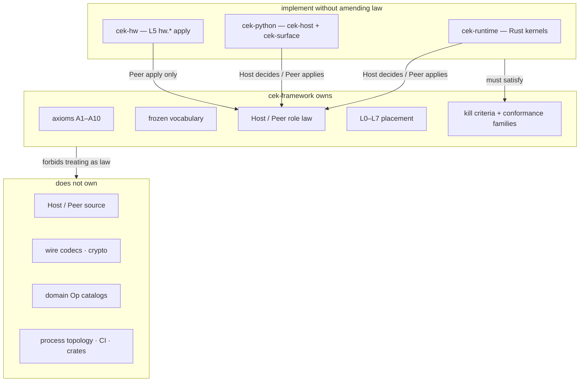

# Architecture and ownership

Read [00 — Mental model](00-mental-model.md) first if you are new.

Law: [`CORE/`](../CORE/). Method: [`META/`](../META/). This page states **who owns what**, including what each part **does not** own.

---

## Ownership diagram



Source: [`diagrams/00-ownership.mmd`](../diagrams/00-ownership.mmd). Law vs implementation: [`diagrams/16-law-vs-implementation.mmd`](../diagrams/16-law-vs-implementation.mmd).

---

## This repository

| | |
|--|--|
| **Owns** | Meanings, axioms, frozen vocabulary, layer model, Host/Peer *role* law, Cap lifecycle, lineage/reverse obligation, Baseline permanence, kill criteria, conformance *families*, charter amendment process |
| **Does not own** | Host/Peer implementations, wire codecs, Cap cryptography, domain Op catalogs, crates/packages, CI, isolation technology, UI widgets, GPIO, process topology |
| **Interfaces** | Implementations claim alignment against [`CORE/19`](../CORE/19-conformance.md) and [`KILL-CRITERIA.md`](../KILL-CRITERIA.md). They do not amend this charter by shipping code. |

| This repo **is** | This repo **is not** |
|------------------|----------------------|
| Frozen vocabulary and axioms | An npm/cargo/pip library |
| What “correct CEK” means | Runnable Host/Peer |
| Design review checklist | Wire codecs or UI widgets |

---

## Ownership table

| Component | Owns | Does *not* own | Interfaces |
|-----------|------|----------------|------------|
| **META/** | Method that produces and governs CORE | The law itself (CORE is the product) | CORE remains re-derivable from META tests |
| **CORE/** | Locked language law 00–27 | Implementation languages, crate layout, Op catalogs | Bound by CHARTER, STABILITY, KILL-CRITERIA |
| **PROPOSALS/** | Optional unfrozen extensions | Law until CHARTER adoption | [`CORE/12-change-law.md`](../CORE/12-change-law.md) |
| **diagrams/** | Conceptual mermaid of the law | Runtime pipelines, crate graphs | Render-only; not a second vocabulary |
| **Host (role)** | Mint/verify Cap, dispatch, lineage, project, Result | Apply as the mutation path; Peer-supplied “I am allowed” | Intent+Cap in; Result+Ops out; lineage Host-owned |
| **Peer (role)** | Apply Ops in order under profile; optional apply receipt | Root mint, business truth, Cap authority | Ops in; optional receipt out. Receipt is not a Cap |
| **Cap** | Permission to submit a class of Intent | Correlation; Activity lifetime; session/TLS identity | Binds action, sealed args, validity; optional subject/scopes/once |
| **Intent** | The sealed ask | Permission; apply; undo | Carries action, args, Cap, optional trace |
| **Ops** | Ordered carry-out data in a Result | Code, callbacks, Cap authority | Peer applies in listed order |
| **Result** | Host answer to an Intent | Peer mutation; permission | `ok` + ops / `authority_refusal` / `dispatch_error` |
| **Activity** | Bounded work lifetime; reverse on end | Permission by itself; correlation | Lives in Context; submits under Caps; parts load under Caps |
| **Context** | Mediated visibility of an Activity | Ambient authority; substitute for Cap | inject / limit / isolate only narrow |
| **lineage** | Cause trail under Cap/Activity plus reverse plan | Generic logs; telemetry; Cap; trace | Reverse prefers landed set when a receipt exists; else authorized set |
| **trace** | Group related Intents | Permission, execute, undo | Optional association on Intent; each step still needs its Cap |
| **Baseline** | Permanent interop contract | A runtime object you “open”; profile-as-authority | Host projects `profile ∩ ability ∪ Baseline` fallback |
| **profile** | Declared Peer apply ability | Cap authority; mint | Missing profile → Baseline projection |
| **cek-runtime** | Rust Host/Peer kernels, contract, vectors, CLI | Law, Python surface, hardware drivers | Implements CORE without amending it |
| **cek-python** | Python `cek-host` + `cek-surface` | Law, Rust kernels, `hw.*` catalog | Implements CORE; composes Ops |
| **cek-hw** | L5 `hw.*` Ops, Peer driver, serial, MCU port | Host kernel, law | Apply-only. Host still decides. GPIO is another world, like DOM |
| **L5–L7** | Domain meaning, optional policy, product logic | Redefining A1–A10 | Must lower to Baseline or refuse. Never ambient-allow |

---

## Layers

Lower never depends on higher. L5–L7 replace without changing L0–L2 meaning. L6 does not punch a hole through Cap verify or Ops-only emission.

```text
L0  Law         axioms + Baseline
L1  Kernels     Host · Peer
L2  Bound work  Activity · Context · inject · limit · isolate · lineage · reverse · part
L3  Correlate   trace
L4  Negotiate   profile
L5  Drivers     domain Ops
L6  Policy      optional
L7  Application product logic
```

| Layers | Change severity |
|--------|-----------------|
| L0–L2 | Charter-level |
| L3—L4 | Preserve A6 and Baseline |
| L5–L7 | Normal evolution if axioms hold |

Source: [`CORE/05-layers.md`](../CORE/05-layers.md) · diagram: [`diagrams/02-layers.mmd`](../diagrams/02-layers.mmd).

---

## L1 kernels (closed set)

Exactly two kernels. There is no third L1 kernel.

| Kernel | Role | Duty | Does *not* |
|--------|------|------|------------|
| **Host** | Decide | Mint/verify Cap; consume once / idempotency bind; dispatch; lineage; project; Result | Rely on Peer to confirm Cap; emit mutate Ops after refuse |
| **Peer** | Carry out | Apply Ops in order under profile; ignore unknown optional meta; optional receipt | Mint root Caps; invent business truth |

Caller, bootstrap, lineage store, recovery Cap, profile, transport, and conformance harness are **not** kernels.

Ordered Host pipeline (no shared-world side-effects before the gate):

1. **Verify** Cap against the Intent. Refuse → no mutate Ops.
2. **Consume** single-use and check optional idempotency bind **before** side-effects when required. Store down → refuse.
3. **Dispatch** only after verify (and consume/bind).
4. **Record lineage** when the Cap is revocable or the Activity is endable.
5. **Project** Ops to the Peer’s profile, falling back to Baseline.
6. Return **Result**.

Additionally: **Mint** is a Host-side privilege (including bootstrap and recovery Caps).

A Cap minted under one Host’s policy is not automatically authority on another Host. Cross-Host acceptance requires explicit shared verify policy. Default is separate trust domains.

Many implementations of Host and of Peer exist. Multiplicity does not add roles.

Source: [`CORE/06-host-peer.md`](../CORE/06-host-peer.md) · diagrams: [`14-l1-kernels.mmd`](../diagrams/14-l1-kernels.mmd), [`13-host-pipeline.mmd`](../diagrams/13-host-pipeline.mmd).

---

## Cap vs trace vs Activity

| Concept | Grants permission? | Groups steps? | Owns lifetime undo? |
|---------|--------------------|---------------|---------------------|
| Cap | Yes | No | Via lineage when revocable |
| trace | No | Yes | No |
| Activity | No | No | Yes — reverse lineage on end |

Cap conceptual lifecycle: `Minted → Active → Consumed | Expired | Revoked`. Replay of a Consumed once-Cap refuses.

Source: [`CORE/08-cap.md`](../CORE/08-cap.md) · [`diagrams/12-cap-lifecycle.mmd`](../diagrams/12-cap-lifecycle.mmd).

---

## Fixed law, mobile surface

```text
FIXED (must not drift)
  axioms · vocabulary · Host/Peer split · Cap-only · Ops-only
  lineage/reverse obligation · Baseline · fail closed · trace ≠ authority

MOBILE (moves without charter amendment)
  domain Ops · profiles · L6 policy · L7 product · Cap encoding
  transports · optional receipts/idempotency · driver quality
```

When something moves, it moves **above** L2 or in encoding. It does not silently redefine Intent, Cap, or Baseline.

Source: [`CORE/24-moving-parts-and-corners.md`](../CORE/24-moving-parts-and-corners.md).

---

## Next

[02 — Happy path](02-happy-path.md) · [03 — Current reality](03-current-reality.md) · [`CORE/SUMMARY.md`](../CORE/SUMMARY.md)
