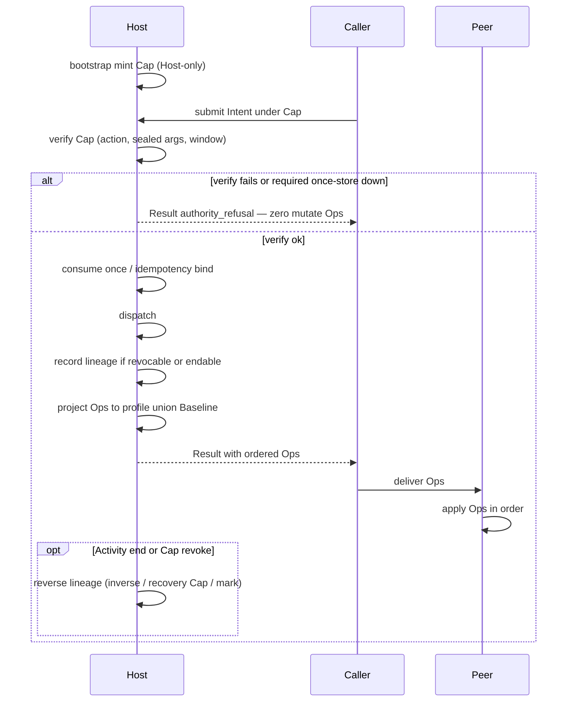

# Happy path

Read [00 — Mental model](00-mental-model.md) first if you are new. Ownership: [01](01-architecture-and-ownership.md).

This page is the walkthrough. This repository is law, not a package — the path is a **design walk** you can check against any Host/Peer, plus one **refusal** and one **reverse failure**. Executable kernels live in sibling repos.

---

## Primary flow



Source: [`diagrams/00-primary-flow.mmd`](../diagrams/00-primary-flow.mmd). Same path in law: [`CORE/13-canonical-story.md`](../CORE/13-canonical-story.md), [`CORE/06-host-peer.md`](../CORE/06-host-peer.md), [`CORE/23-scenarios.md`](../CORE/23-scenarios.md) S1.

Text form:

```text
mint → submit → verify → Ops → apply → end → reverse
```

---

## Zero to working (design checklist)

Copy this list. A design is on the happy path when every line is true.

1. **Bootstrap** — Host holds minimal root policy and mints the first Caps. Peer has no bootstrap mint API. [`CORE/15`](../CORE/15-bootstrap.md)
2. **Open Activity** — Cap-gated. Context is mediated. `inject` declares requirements; undeclared access fails. Optional `limit` / `isolate` only narrow. [`CORE/07`](../CORE/07-activity-context.md)
3. **Load parts** — under Caps into the Activity. [`CORE/07`](../CORE/07-activity-context.md) A9
4. **Mint Cap** — Host (or meta-Cap). Cap binds action, sealed args, validity; optional subject, scopes, once. State: Minted → Active. [`CORE/08`](../CORE/08-cap.md)
5. **Submit Intent** — `{ action, args, Cap, optional trace }`. Sealed args match the Cap bind. [`CORE/21`](../CORE/21-intent-result-ops.md), [`CORE/22`](../CORE/22-sealed-args.md)
6. **Host verify** — integrity, expiry, action bind, sealed args, optional subject/scopes. Failure → **authority_refusal**, zero mutate Ops. [`CORE/06`](../CORE/06-host-peer.md)
7. **Consume / bind** — single-use consume and optional idempotency bind **before** side-effects. Required store down → refuse. [`CORE/08`](../CORE/08-cap.md), [`CORE/26`](../CORE/26-idempotency.md)
8. **Dispatch** — only after verify. Host reloads authoritative state from its store; it does not trust caller-supplied world state. [`CORE/22`](../CORE/22-sealed-args.md)
9. **Lineage** — if Cap is revocable or Activity is endable: record authorized Ops + reverse plan. [`CORE/09`](../CORE/09-lineage-reverse.md)
10. **Project** — Ops ⊆ Peer profile ∪ Baseline fallback. Projection is Host-side. [`CORE/11`](../CORE/11-baseline-profile.md)
11. **Result** — ordered Ops as data. No Baseline eval. [`CORE/21`](../CORE/21-intent-result-ops.md)
12. **Peer apply** — in listed order under profile. Optional apply receipt (not a Cap). [`CORE/06`](../CORE/06-host-peer.md), [`CORE/25`](../CORE/25-landed-and-receipts.md)
13. **Correlate** — related Intents may share a **trace**. Each step still has its own Cap. [`CORE/10`](../CORE/10-trace.md)
14. **End** — Activity complete/cancel/unload or Cap revoke → **reverse** lineage. [`CORE/09`](../CORE/09-lineage-reverse.md)
15. **Interop** — a Baseline-only Peer still applies projected classic Ops. [`CORE/11`](../CORE/11-baseline-profile.md)

Canonical speech test: if a feature cannot be inserted into this narrative without a new kernel noun, it fails [`META/10`](../META/10-canonical-speech-test.md).

---

## One failure: authority refusal

Scenario S5 in [`CORE/23-scenarios.md`](../CORE/23-scenarios.md).

**Setup.** Caller submits an Intent with an invalid, expired, replayed once-Cap, or sealed-arg mismatch.

**What the Host does.**

1. Verify fails (or required once-store is down).
2. Host returns `Result` class **authority_refusal**.
3. **Zero mutate Ops.** No shared-world change. Lineage for a refused ask does not invent a cause.

**What the Peer does.** A refused Result is not applied as mutation. Apply of a refusal is a no-op on the world.

**Recovery.**

- Refusal is the correct outcome of the authority path. It is not a soft business miss. Callers do not retry the same dead Cap.
- Obtain a **valid Cap** (Host mint or meta-Cap) and submit a new Intent.
- Replay of a Consumed once-Cap continues to refuse.

This is fail closed (A5). Treating unauthorized as “try apply anyway” is K5.

---

## One reverse failure: cannot undo

Scenario S7 in [`CORE/23-scenarios.md`](../CORE/23-scenarios.md). Reverse rules: [`CORE/09`](../CORE/09-lineage-reverse.md), [`CORE/27`](../CORE/27-recovery-cap.md).

**Setup.** Activity ends or Cap is revoked. Some landed Ops have no true inverse (external world already moved).

**What reverse does, in order.**

```text
Activity end / Cap revoke
  → reverse(lineage)
      → inverse Ops when possible
      → else submit compensation Intents under recovery Cap
      → else mark non-reversible + audit
```

- Reverse prefers the **landed set** when an apply receipt exists; otherwise the **authorized set**. [`CORE/25`](../CORE/25-landed-and-receipts.md)
- A **recovery Cap** is a real Cap: Host-minted, narrow, verified, fail closed. It is not a back door and not bootstrap. [`CORE/27`](../CORE/27-recovery-cap.md)
- If compensation itself fails → **mark non-reversible** for the original cause.

**Forbidden recovery.** Reporting clean reverse when inverse/compensation failed. That is K12.

**Honest recovery.** The mark plus audit *is* the completion of reverse. The world may stay changed; the books do not lie.

---

## Defaults when unsure

| Situation | Do |
|-----------|-----|
| Authority unclear | Refuse |
| Unknown optional meta | Ignore |
| Peer cannot do rich Ops | Lower to Baseline |
| Undo impossible | Mark non-reversible; do not fake success |
| Multi-step group | trace (still Cap each step) |
| Partial apply | reverse prefers **landed** Ops if receipt exists |
| Compensation | recovery Cap; else mark non-reversible |
| Required once-store down | Refuse |
| Concurrent single-use Cap | At most one consume wins |

Closed corner catalog: [`CORE/24`](../CORE/24-moving-parts-and-corners.md). Diagram: [`diagrams/11-corner-defaults.mmd`](../diagrams/11-corner-defaults.mmd).

---

## Executable path (sibling kernels)

This repo has no package. First running Host/Peer:

| Runtime | First command | Notes |
|---------|---------------|--------|
| [cek-python](https://github.com/bitplorer/cek-python) | `pip install -e ./cek-host -e ./cek-surface` then `python -m cek_host create-app ./hello-cek && python ./hello-cek/app.py` | Python Host + surface. Start at that repo’s `START.md`. |
| [cek-runtime](https://github.com/bitplorer/cek-runtime) | `cargo test --workspace` then `cargo run -p cek-cli -- demo` | Rust reference Host/Peer. |
| [cek-hw](https://github.com/bitplorer/cek-hw) | `python -m cek_hw.cli vectors` | L5 `hw.*` apply only. A refused Result does not move a pin. |

Those commands are taken from the live sibling READMEs. They are not law. They do not amend this charter.

---

## Not CEK if

Ambient allow without Cap · Peer root mint · trace as permission · silent Baseline break · free side-effects outside Ops · mutate after Cap fail · limit that widens

Full list: [`KILL-CRITERIA.md`](../KILL-CRITERIA.md).

---

## Next

| Depth | Doc |
|-------|-----|
| All concepts | [`CONCEPTS.md`](../CONCEPTS.md) |
| Irreducible core | [`CORE/QUICKSTART.md`](../CORE/QUICKSTART.md) |
| Interop scenarios S1–S8 | [`CORE/23-scenarios.md`](../CORE/23-scenarios.md) |
| Corners | [`CORE/24-moving-parts-and-corners.md`](../CORE/24-moving-parts-and-corners.md) |
| Security | [`CORE/14-security-model.md`](../CORE/14-security-model.md) |
| Intended vs actual | [03 — Current reality](03-current-reality.md) |
