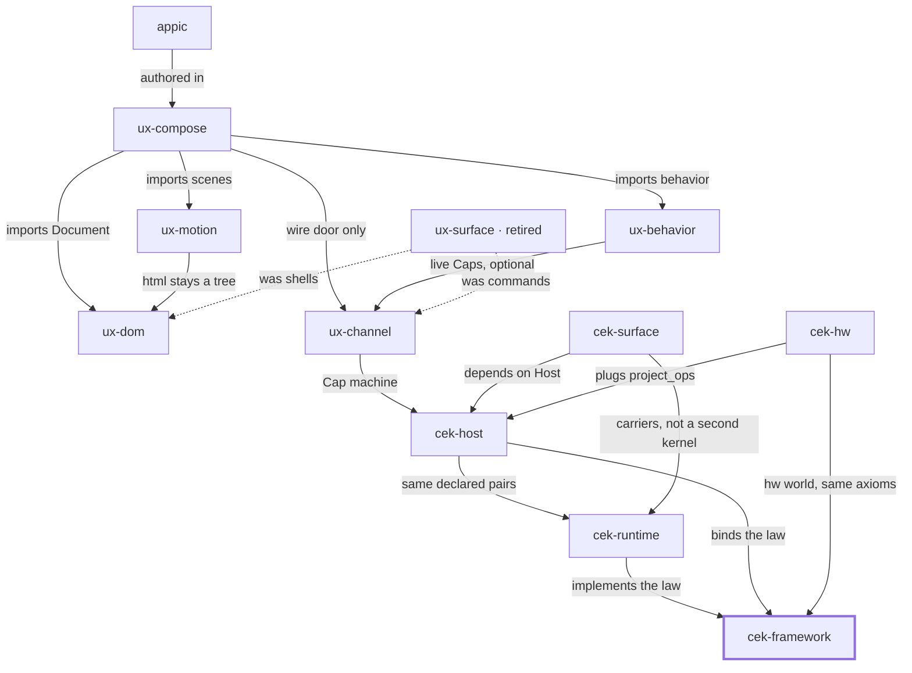

# Place in the stack

**You are here:** `cek-framework` in [bitplorer/cek-framework](https://github.com/bitplorer/cek-framework).

The rulebook for who may change a shared world, how the change is listed, and how it is undone. Law and vocabulary only. Not a package.

The picture is the same in every repo. The thick stroke is this library. A missing line is a missing door, not a forgotten one. Dashed lines are history.

## Owns

The axioms, the happy path, ownership, and the kill criteria.

## Refuses

Shipping a runtime. Minting. Applying.

## Install

Read it. The kernels are cek-runtime, cek-python, and cek-hw.

## Doors

### Used by

- [cek-runtime](https://github.com/bitplorer/cek-runtime) — implements the law
- [cek-host](https://github.com/bitplorer/cek-python) — binds the law
- [cek-hw](https://github.com/bitplorer/cek-hw) — hw world, same axioms

## The stack

## The walk

Mint, intent, verify, project, apply, undo.

1. **Mint.** Host mints a Cap. The subject on the Cap is the subject in the args. dev is the workshop. prod refuses the workshop secret.
2. **Intent.** Channel carries action, args, and cap. That is the click. It is not a form post.
3. **Verify.** Host verifies the Cap before any shared-world write. A bad Cap, or a store that is down, refuses. ops is empty. The peer never mints.
4. **Project.** Only declared pairs leave the host. Baseline and ui.dom are the catalog. Hardware pairs arrive through project_ops. They are not a fork of Host.
5. **Apply.** The peer applies the ops. DOM is one world. GPIO is another. Surface carries the IR. It does not decide.
6. **Undo.** **This library.** Lineage records the cause. End or revoke reverses it, or the op is marked non-reversible. A trace id never grants permission.

This library is step 6 of the walk. It does not execute the walk.

## Notes

- Only a verified Cap is authority.
- Effects at the kernel boundary are ordered ops.
- Host decides. Peer applies.
- Fail closed: a bad Cap writes nothing.
- A trace id never grants permission.
